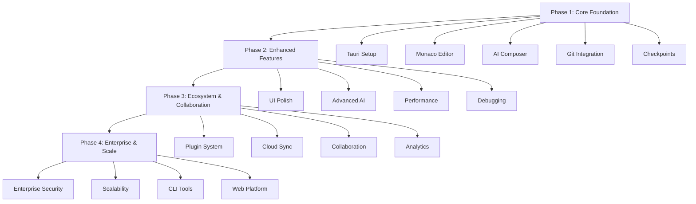

# Development Phases

This directory contains detailed documentation for each development phase of MarieIDE, from initial foundation to enterprise-scale deployment.

## 🚀 Phase Overview

| Phase | Duration | Focus | Status |
|-------|----------|-------|--------|
| **[Phase 1: Core Foundation](phase1/)** | 8-12 weeks | Functional IDE with basic AI | 📋 Planning |
| **[Phase 2: Enhanced Features](phase2/)** | 6-8 weeks | Production-ready polish | ⏳ Pending |
| **[Phase 3: Ecosystem & Collaboration](phase3/)** | 8-10 weeks | Plugin system and collaboration | ⏳ Pending |
| **[Phase 4: Enterprise & Scale](phase4/)** | 6-8 weeks | Enterprise features and scale | ⏳ Pending |

## 📋 Phase 1: Core Foundation
**Timeline**: 8-12 weeks  
**Goal**: Deliver functional IDE with basic AI assistance and version control

### Key Deliverables
- ✅ Tauri + React application with 3-panel layout
- ✅ Monaco Editor integration with multi-file support
- ✅ Basic AI Composer panel with prompt/response
- ✅ Git integration (init, commit, branch, status)
- ✅ Checkpoint system (create, restore, timeline)
- ✅ Terminal panel with shell integration

### Success Criteria
- Functional IDE with all core features working
- <2s startup time, <300MB memory usage
- Basic AI assistance operational
- Checkpoint system reliable and fast

## 🎨 Phase 2: Enhanced Features
**Timeline**: 6-8 weeks  
**Goal**: Polish core features and add advanced functionality for production readiness

### Key Deliverables
- ✅ Production-ready UI/UX with professional design system
- ✅ Advanced AI capabilities (multiple models, smart features)
- ✅ Enhanced Git integration (visual diff, merge, advanced operations)
- ✅ Intelligent checkpoint system with auto-checkpointing
- ✅ Performance optimization for large projects
- ✅ Debugging tools and developer experience enhancements

### Success Criteria
- Production-ready stability and performance
- <1.5s startup time, <250MB memory usage
- Advanced AI features significantly improving productivity
- Professional UI/UX matching industry standards

## 🔌 Phase 3: Ecosystem & Collaboration
**Timeline**: 8-10 weeks  
**Goal**: Build developer ecosystem and collaboration features for community growth

### Key Deliverables
- ✅ Comprehensive plugin system and marketplace
- ✅ Cloud synchronization and backup features
- ✅ Real-time collaboration capabilities
- ✅ Advanced AI learning and adaptation
- ✅ Analytics and insights platform
- ✅ Community features and knowledge sharing

### Success Criteria
- Active plugin ecosystem with 20+ extensions
- Cloud sync working reliably across devices
- Real-time collaboration features operational
- 10,000+ active users

## 🏢 Phase 4: Enterprise & Scale
**Timeline**: 6-8 weeks  
**Goal**: Enterprise features and scalability for large-scale deployment

### Key Deliverables
- ✅ Enterprise-grade security and compliance (SSO, audit, encryption)
- ✅ Management and control systems for organizations
- ✅ Massive scalability (100,000+ files, 1M+ users)
- ✅ Comprehensive CLI and automation tools
- ✅ Web platform and mobile companion
- ✅ Enterprise analytics and reporting

### Success Criteria
- Enterprise customers using platform successfully
- Handles projects with 100,000+ files efficiently
- 99.9% uptime for cloud services
- Revenue-positive business model established

## 📊 Phase Dependencies

## 🎯 Phase Success Metrics

### Phase 1 Metrics
- **Performance**: <2s startup, <300MB memory
- **Functionality**: All core features working
- **Quality**: >70% test coverage
- **User Experience**: Intuitive workflows

### Phase 2 Metrics
- **Performance**: <1.5s startup, <250MB memory
- **Quality**: Production-ready, >80% test coverage
- **User Experience**: Professional-grade UI/UX
- **AI Enhancement**: 40% productivity improvement

### Phase 3 Metrics
- **Ecosystem**: 20+ plugins, 10,000+ users
- **Collaboration**: Real-time features operational
- **Community**: Strong developer engagement
- **Platform**: Web and mobile platforms ready

### Phase 4 Metrics
- **Enterprise**: 50+ Fortune 500 customers
- **Scale**: 1M+ users, 100,000+ files per project
- **Business**: $10M+ ARR, revenue-positive
- **Market**: Industry recognition and leadership

## 🔄 Phase Transitions

### Phase 1 → Phase 2
- **Trigger**: All Phase 1 deliverables complete and tested
- **Gate**: Performance targets met, core functionality stable
- **Handoff**: Technical foundation ready for enhancement

### Phase 2 → Phase 3
- **Trigger**: Production-ready product with polished features
- **Gate**: Quality standards met, user feedback positive
- **Handoff**: Stable platform ready for ecosystem building

### Phase 3 → Phase 4
- **Trigger**: Strong community and plugin ecosystem established
- **Gate**: Market traction proven, revenue model validated
- **Handoff**: Platform ready for enterprise scaling

## 📝 Phase Documentation

Each phase directory contains:
- **Requirements**: Detailed requirements and specifications
- **Architecture**: Technical architecture and design decisions
- **Implementation**: Development guidelines and best practices
- **Testing**: Testing strategies and quality assurance
- **Deployment**: Deployment and release procedures

---

*Navigate to individual phase directories for detailed documentation and requirements.*
